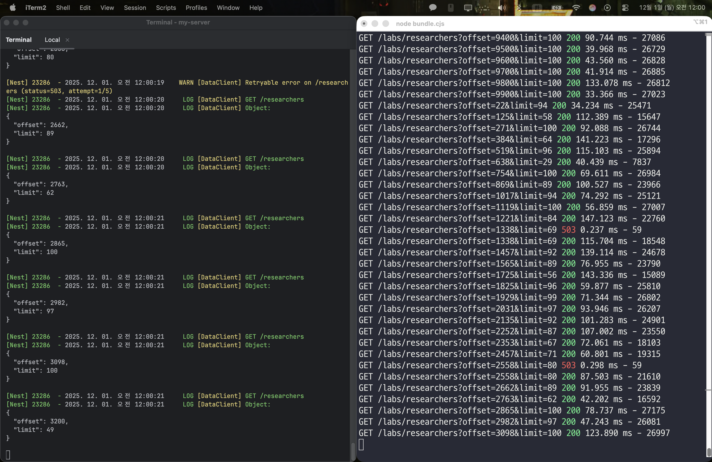
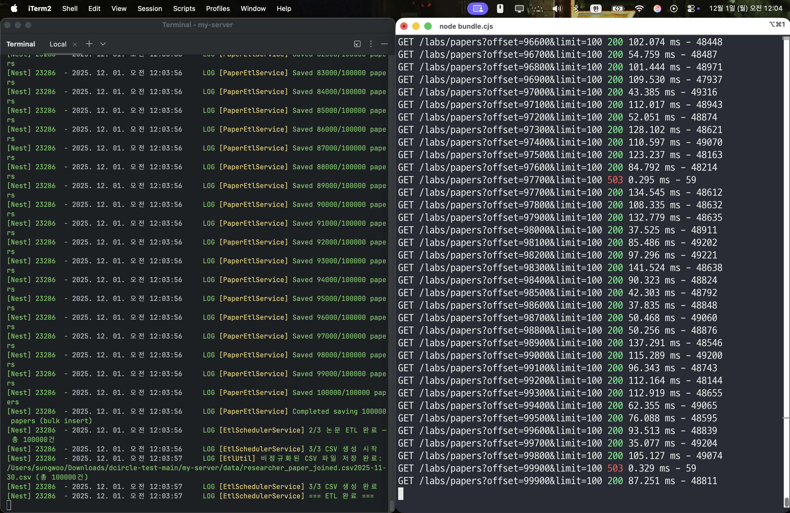

# **🎯 PART 1: ETL 구현**

## **총 소요 시간**

- PART 1 : 스프링[목-금, 12시간 내외] + NestJS 전환 마무리[토-일, 15시간 내외]
- PART 2 : 문서 작성[일-월 6시간 내외]

## 구현 전략

> 최근에 프론트엔드 공부를 하며 자바스크립트에 대한 문법은 알고 있었지만, 1년 넘게 Spring Boot에 익숙해져 있던 저는 바로 NestJS로 작성하는 데에는 제약이 있었습니다.
따라서 LLM 등에 모든 것을 맡기기보다는, 코드 품질을 위해 먼저 익숙한 Spring Boot로 ETL 파이프라인을 완성한 뒤, 이후에 LLM의 도움으로 NestJS로 자연스럽게 전환하는 방식을 택했습니다.
NestJS가 Spring Boot와 유사한 계층 구조를 갖고 있어, 초기 설계를 그대로 유지하면서 무리 없이 마이그레이션할 수 있었습니다.
>

## ERD 설계

  

- 먼저 data-server의 응답 구조를 바탕으로 researcher 와 paper의 필드를 준비한 후, 전체 데이터를 수집하고 나서 정확한 관계를 분석할 수 있었습니다.
    - 처음부터 ERD를 확정할 수 없었던 이유는 실생활에서는 논문에 여러 연구자가 참여할 수 있고, 한 연구자가 여러 논문에 참여할 수 있으므로 N:N 관계의 가능성을 염두에 두어서입니다.
    - 그러나 수집이 완료되고 모든 paper 레코드를 paper의 id로 `group by`하여 검증한 결과, 과제의 데이터셋에서는 논문이 주어지면 담당 연구자 1명이 결정되는 1:N 구조임을 확정하고 이에 맞춰 스키마를 정규화하였습니다.
- university를 독립의 테이블로 둘지에 대해 검토했으나, ETL 파이프라인에 집중해야하므로 별도의 요구사항이 생기기 전까지는 researcher 에 필드로 두기로 결정하였습니다.

## ETL 구현

### 에러 핸들링

- `data-client.ts` 의 `fetchPage()` 에서 503이나 429 에러에 대해 재시도를 합니다.
    - ETL을 구현하면서 API 호출 시 연속으로 5번 실패(503 에러)하는 것을 목격하였으므로 최대 6번 시도합니다.

### API 호출 횟수 줄이기 - `엔티티-etl.service.ts`, `etl.util.ts`

- 날짜 필드가 깨져서 들어오는 경우 재호출이 필요하지만, API 호출 횟수를 줄이는 것이 목표입니다.
  따라서 즉시 재호출하는 것이 아니라 우선 마지막 `window`(또는 블록)까지 호출하여 전체 리스트를 구성한 뒤, 깨져있는 엔티티의 인덱스들(`invalidIndexes`, globalIndex 방식: 만약 아이템이 총 만개면 0~9999)을 검사하여 해당 인덱스의 아이템을 얻기 위해 재호출해나가는 식으로 구현하였습니다.
    - 인덱스는 엔티티 내에 DB와는 상관없는 @Transient 필드로 두었습니다.
    - 인덱스 방식은 기존 리스트의 위치 정보를 유지하며 엔티티를 빠르게 교체하기 위해 적용했습니다.
- 이 때, `invalidIndexes` 는 무분별하게 분산되어있으므로 data-server의 `maxWindowSize`(또는 최대 limit)를 최대한 활용하여 그룹핑할 수 있는 아이템은 최대한 많이 묶어서, 최적화된 윈도우들 각각의 offset과 limit 에 대한 리스트를 반환하는 함수 `groupOptimizedWindows()` 를 구현하였습니다.
    - 첫 번째 인덱스부터 묶을 수 있는 아이템들을 `maxWindowSize` 이하의 사이즈로 바로 묶어 나가는 그리디 알고리즘을 택하였습니다.
- 각 루프마다 잘못된 날짜를 포함하는 엔티티를 ‘체로 거르는 것’과 같이 구현하였습니다.

### DB에 저장 - `엔티티-etl.service.ts`

- Paper 의 경우 `totalCount`가 10만 개인 것처럼 대량의 데이터를 다루는 ETL 특성 상, 삽입 시 QueryBuilder로 1000개 batch size로 bulk insert 하는 방식을 택하였습니다.
- ETL은 매달 수행되므로,  `orUpdate()` 를 통한 업서트로 data-server의 최신 상태를 반영하도록 하였습니다.

### csv 저장 - `etl.util.ts`

- researcher와 paper를 조인한 단일 csv로 저장합니다.
- ETL은 매달 수행되므로, 저장되는 csv 이름 뒤에 날짜를 붙였습니다.

# 번외) 12/1 실제 작동 확인

<table>
  <tr>
    <td width="50%">
      
    </td>
    <td width="50%">
      
    </td>
  </tr>
</table>

